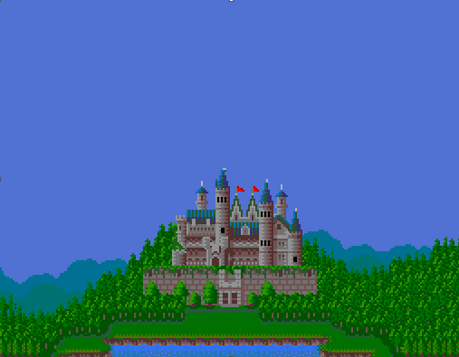

# 2001_DOS_remake_Dyna_Blaster_game
Римейк старой MS-DOS игры King's Bounty на  Borland Pascal 7.0

Игра написана для платформы MS-DOS на языке Borland Pascal 7.0. Используются графический режим VGA с разрешением 320х200 и с 256 цветами. Для работы со спрайтами написанны собственные библиотеки, основанные на прямой записи в видеопамять. Графические ресурсы получены из дампов оперативной памяти оригинальной игры.

* Читать на других языках: [English](README.md), [Русский](README.ru.md)

Скриншоты геймплея:

# Оглавление
- [Установка](#Установка)
- [Краткое описание игры](#Краткое-описание-игры)
- [Играть в браузере](#Играть-в-браузере)

# Установка

Для начала игры достаточно скачать файл DYNA.zip, распаковать архив и запустить DYNA.exe, желательно в DosBox.

Либо можно играть онлайн в браузере через эмулятор js-dos [Играть в браузере](#Играть-в-браузере)

Для компиляции из исходников (папка code) необходимо использовать компилятор Borland Pascal 7.0

# Краткое описание игры

Необходимо ставить бомбы для того, чтобы расчищать игровое поле, находить бонусы (увеличивающие достопное число одновременно устанавливаемых бомб и мощность взрыва). Для победы необходимо подорвать на бомбе другого игрока.
В игре реализован только режим игрок против игрока. Одиночный режим не реализован (при выборе одиночной игры проигрывается финальный ролик)

# Играть в браузере

По ссылке ниже можно попробовать игру в браузере, через эмулятор js-dos

[Играть](https://andrey-andrianov.github.io/sites/jsdos/dyna2.html)

Для более удобного управления с мобильных устройств на экран добавлены наиболее часто используемые клавиши. Их можно скрыть или показать из панели управления DosBox слева. Также для игры на мобильных устройствах удобно добавить страницу на домашний экран устройства.
